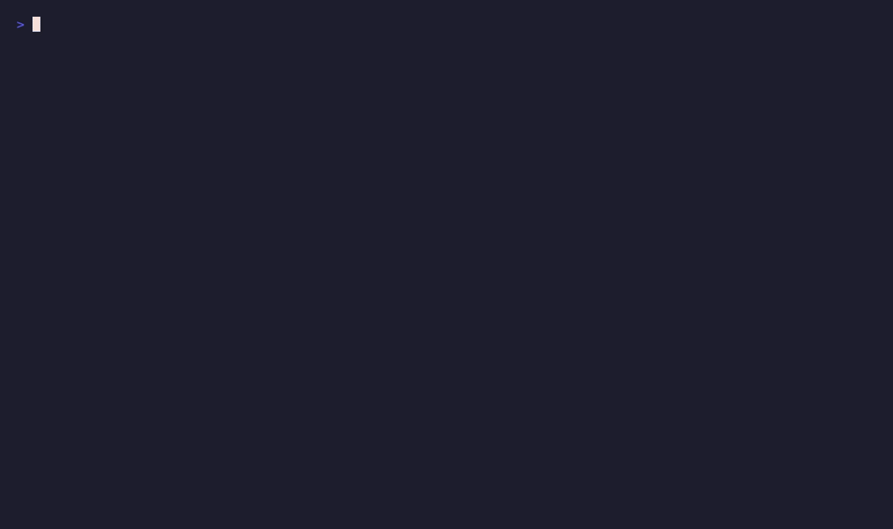

# rxray

Deterministic regex worst-case complexity (ReDoS) analysis. Given a pattern and
a target engine, `rxray` classifies its worst-case match complexity under
backtracking semantics as **linear**, **polynomial**, or **exponential** — no
LLM, no execution of the analyzed pattern.

A single dependency (`regex-syntax`), pure Rust, MSRV 1.74. Usable as a library
or a CLI gate.

> **Status: Phase 1.** Sound NFA-based ambiguity analysis over a hand-rolled
> Thompson NFA built from the `regex-syntax` HIR:
>
> - **EDA** (exponential) — detected via the product automaton `A×A`: a diagonal
>   state on a cycle through an off-diagonal state. Sound **and** complete for
>   exponential ambiguity. Catches e.g. `(a+)+`, `(aa|a)+`, `(a*)*`.
> - **IDA** (polynomial) — detected via the triple product `A³`
>   (`(p,p,q)→(p,q,q)`). Sound detection with an **exact** polynomial degree
>   (longest IDA-pair chain).
> - **Attack synthesis** — `attack()` produces a *verified* input that triggers
>   the backtracking (validated by a step-counting matcher).
>
> Early release (`0.x`) — the API may change.

## Demo



```console
$ rxray 'a+b+'                              # safe
Linear	a+b+
                                            # exit 0

$ rxray 'a*a*$'                             # quadratic — exceeds the default "linear" budget
Polynomial(2)	a*a*$
  - super-linear backtracking: polynomial O(n^2)
                                            # exit 1

$ rxray --max-complexity poly 'a*a*$'       # ...but allowed when poly is permitted
Polynomial(2)	a*a*$
  - super-linear backtracking: polynomial O(n^2)
                                            # exit 0

$ rxray --attack '(a+)+$'                   # exponential, with a verified attack
Exponential	(a+)+$
  - two distinct match paths read the same pumpable input (exponential backtracking)
  attack (30x): "aaaaaaaaaaaaaaaaaaaaaaaaaaaaaaa\0"
                                            # exit 1
```

## Compared to other ReDoS tools

| Tool | Runtime | Approach | Verified attack | Library API | Maintained |
|------|---------|----------|:---:|:---:|:---:|
| **rxray** | Rust, 1 dep | deterministic automaton (sound+complete EDA, sound IDA) | yes | yes | active |
| [recheck](https://github.com/makenowjust-labs/recheck) | Scala / JS (npm) | hybrid: automaton + fuzzing | yes | yes | active |
| [regexploit](https://github.com/doyensec/regexploit) | Python | static, heuristic | yes | partial | last 2024 |
| [redos-detector](https://github.com/tjenkinson/redos-detector) | TypeScript | deterministic (proof-based) | no | yes | active |
| [vuln-regex-detector](https://github.com/davisjam/vuln-regex-detector) | Perl (ensemble) | runs several detectors | varies | no | last 2022 |

rxray's niche is being **native, deterministic, and embeddable**: a single-dependency
Rust library + CLI with no JVM/Node/Python runtime, sound *and* complete exponential
detection, and an exact polynomial degree. If you live in the JS ecosystem,
[recheck](https://github.com/makenowjust-labs/recheck) is the most mature alternative.

## Known limitations

- **Dialect**: backreferences and lookaround are not representable in an NFA and
  Rust's `regex-syntax` rejects them, so such patterns return
  `AnalyzeError::Parse`. (~8% of a real-world corpus.) Supporting them needs a
  different front end — future work.
- **ASCII analysis**: patterns are parsed in ASCII mode (`unicode(false)`).
  Ambiguity is *structural*, so verdicts are identical to Unicode mode, but the
  analyzed character sets are ASCII.
- **Parser normalization**: analysis reflects `regex-syntax`'s normalization
  (e.g. it collapses `a|a → a`), which can differ from another engine's own
  parser — a pattern exponential on a naive backtracker may be reported safe if
  the parser simplifies the ambiguity away.
- **Size / budget**: patterns whose expanded NFA would be huge (large bounded
  reps like `{1000}`) return `AnalyzeError::TooComplex`. Internal visit budgets
  bound analysis time; a budget cutout can only *under*-report (lower degree /
  miss), never over-report — there are no false positives.

## Example

```rust
use rxray::{analyze, ComplexityClass, Engine};

let report = analyze("(a+)+", Engine::Pcre2).unwrap();
assert_eq!(report.worst, ComplexityClass::Exponential);

// Linear-by-construction engines (Rust regex, Go RE2) are never flagged.
let report = analyze("(a+)+", Engine::RustRegex).unwrap();
assert_eq!(report.worst, ComplexityClass::Linear);

// Synthesize a verified attack input.
use rxray::attack;
let atk = attack("(a+)+$", Engine::Pcre2, 30).unwrap();
assert!(atk.value.contains("aaaa")); // 30 pumps + a breaker
```

## Install

```sh
cargo install rxray        # CLI
cargo add rxray            # library
```

## CLI

```sh
rxray [--engine E] [--max-complexity linear|poly|poly:K|exp] [--attack] <PATTERN>
```

The pattern is taken from the argument, or from stdin if omitted. `--attack`
prints a verified attack string (see the [Demo](#demo) above).

Exit codes make it a CI gate:

| Code | Meaning |
|------|---------|
| `0`  | within `--max-complexity` (default `linear`) |
| `1`  | exceeds the threshold (vulnerable) |
| `2`  | parse error / too complex / usage error |

## License

MIT — see `LICENSE`.
